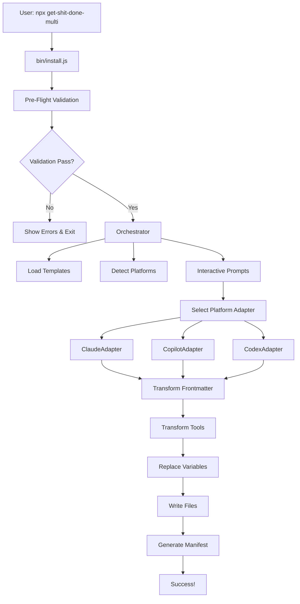

# Architecture

Technical architecture documentation for contributors and developers.

## System Overview

GSD Multi is a **template-based installer** that transforms universal skill/agent templates into platform-specific
files. The system follows a clean separation of concerns:

- **Templates** (`/templates/`) - Universal source of truth
- **Adapters** (`/bin/lib/adapters/`) - Platform-specific transformations
- **Orchestrator** (`/bin/lib/orchestrator.js`) - Installation coordination
- **Validation** (`/bin/lib/validation/`, `/bin/lib/preflight/`) - Security and pre-flight checks

## Architecture Diagram (Mermaid)



## Module Responsibilities

### `/templates/`

**Purpose:** Universal skill and agent definitions with template variables

**Structure:**

```text
templates/
├── skills/
│   └── gsd-*/
│       ├── SKILL.md
│       └── version.json
├── agents/
│   ├── gsd-*.agent.md
│   └── versions.json
└── get-shit-done/
    ├── references/
    ├── templates/
    └── .gsd-install-manifest.json
```

**Template Variables:**

- `{{PLATFORM_ROOT}}` → `.claude/`, `.github/`, `.codex/`
- `{{COMMAND_PREFIX}}` → `/gsd-`, `$gsd-`
- `{{VERSION}}` → Current version (e.g., "2.0.0")
- `{{PLATFORM_NAME}}` → "claude", "copilot", "codex"

**Frontmatter:**

- Skills: Corrected format (allowed-tools, argument-hint, no unsupported fields)
- Agents: Corrected format (tools string, skills auto-generated, no metadata block)

### `/bin/lib/adapters/`

**Purpose:** Platform-specific transformations (one adapter per platform)

**Files:**

- `base-adapter.js` - Abstract base class
- `claude-adapter.js` - Claude Code transformations
- `copilot-adapter.js` - GitHub Copilot CLI transformations
- `codex-adapter.js` - Codex CLI transformations

**Architecture Rule (PLATFORM-02):**

- Each adapter is ISOLATED - no inheritance between platform adapters
- Code duplication is ACCEPTABLE over coupling
- Changes to one platform should NOT affect others

**Adapter Methods:**

```javascript
class PlatformAdapter {
  transformFrontmatter(frontmatter, type)  // Transform metadata
  transformTools(tools)                    // Map tool names
  transformPath(path)                      // Rewrite path references
  getFileExtension(type)                   // .md vs .agent.md
  getTargetDir(scope)                      // Installation directory
}
```

**Tool Name Mappings:**

- Claude: Read, Write, Edit, Bash, Grep, Glob, Task
- Copilot/Codex: read, write, edit, execute, search, glob, agent

### `/bin/lib/orchestrator.js`

**Purpose:** Coordinate installation phases

**Phases:**

1. Template validation (check templates exist and parse correctly)
2. Skill installation (transform and write skill files)
3. Agent installation (transform and write agent files)
4. Shared directory installation (copy get-shit-done/ folder)
5. Manifest generation (scan installed files, write manifest)

**Key Functions:**

- `installSkills(adapter, scope)` - Install all 29 skills
- `installAgents(adapter, scope)` - Install all 13 agents
- `installShared(adapter, scope)` - Copy shared directory with variable replacement
- `generateAndWriteManifest(targetDir, platform, scope, version)` - Create manifest

### `/bin/lib/preflight/`

**Purpose:** Single-point validation before installation

**Files:**

- `pre-flight-validator.js` - Orchestrates all validation

**Validation Checks:**

1. Templates exist (`/templates/skills/`, `/templates/agents/`)
2. Disk space (2MB + 10% buffer)
3. Write permissions (actual write test)
4. Path security (8-layer validation)
5. Symlink detection and resolution
6. Existing installation detection

**Validation Flow:**

```javascript
validateBeforeInstall(targetDir, platform)
  → checks.push(...diskSpaceCheck())
  → checks.push(...permissionsCheck())
  → checks.push(...pathSecurityCheck())
  → checks.push(...symlinkCheck())
  → checks.push(...existingInstallCheck())
  → return { valid: true/false, errors: [], warnings: [] }
```

### `/bin/lib/validation/`

**Purpose:** Transversal validation modules (used by preflight)

**Files:**

- `path-validator.js` - 8-layer path security validation
- `template-validator.js` - Template structure verification

**Path Validation Layers:**

1. Null byte check (`\0`)
2. URL decoding (detect `%2e%2e%2f`)
3. Traversal detection (`../`, `..\`, absolute paths)
4. Containment verification (resolved path inside target)
5. Allowlist enforcement (`.claude`, `.github`, `.codex`, `get-shit-done`)
6. Length limits (260 Windows, 4096 Unix)
7. Windows reserved names (CON, PRN, AUX, etc.)
8. Symlink resolution (single-level only, chains rejected)

### `/bin/lib/paths/`

**Purpose:** Path utilities (used by validation and orchestrator)

**Files:**

- `path-resolver.js` - Path resolution and normalization
- `symlink-resolver.js` - Single-level symlink resolution with chain detection

## Installation Flow

### Step-by-Step

1. **Entry Point** (`bin/install.js`):
   - Parse CLI flags
   - Show banner
   - Call pre-flight validation
   - If validation passes → call orchestrator

2. **Pre-Flight Validation** (`bin/lib/preflight/pre-flight-validator.js`):
   - Collect all validation checks
   - Run checks in parallel
   - Group errors and warnings
   - Return validation result

3. **Orchestrator** (`bin/lib/orchestrator.js`):
   - Load templates from `/templates/`
   - Parse frontmatter with gray-matter
   - Select platform adapter (Claude/Copilot/Codex)
   - Transform frontmatter → tools → paths
   - Replace template variables
   - Write files to target directory
   - Scan written files
   - Generate manifest with file list

4. **Manifest Generation** (post-installation):
   - Two-pass write (empty → scan → rewrite)
   - Include manifest itself in files array
   - Store version, platform, scope, timestamp, files

5. **Success Message**:
   - Show installation summary
   - Display next steps
   - Exit

## Contributing

See [CONTRIBUTING.md](../CONTRIBUTING.md) for:

- Development setup
- Test commands
- PR process
- Commit conventions

## Next Steps

- [How GSD Works](how-gsd-works.md) - User-facing workflow
- [Platform Specifics](platform-specifics.md) - Platform differences
- [CONTRIBUTING.md](../CONTRIBUTING.md) - Contribution guidelines
